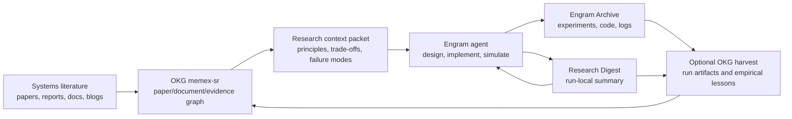

# OKG Memex-SR Integration

## Purpose

Engram already provides a run-local memory loop: each agent reads the
Research Digest and archived workspaces from prior agents, runs
experiments, and hands off a compact summary to the next agent. OKG
should provide the missing cross-run and cross-domain layer: a durable,
literature-backed systems research memory that can teach agents the
principles, mechanisms, trade-offs, and failure modes discovered across
the systems/database literature.

The initial integration keeps Engram's Archive and Research Digest
unchanged. OKG is added as an external knowledge substrate, available
through the `external/okg` submodule. Memex-SR deployment planning and
deployment-owned implementation live under
[`deployments/memex-sr`](../deployments/memex-sr/README.md).

New collaborators who have not worked with OKG should start with
[`deployments/memex-sr/docs/okg-newcomer-guide.md`](../deployments/memex-sr/docs/okg-newcomer-guide.md).

## Paper Context

The Glia paper frames the scientific-discovery loop as a single agent
that iteratively hypothesizes, implements, evaluates, and refines system
designs. Its main lesson for OKG is that agents need more than
retrieval; they need domain principles that help them choose productive
directions before running expensive experiments.

The Engram paper identifies two failure modes that matter here:

- Evolutionary methods can get trapped in local neighborhoods because
  they optimize scalar scores over small code mutations.
- Single long-context agents hit a coherence ceiling, while independent
  runs fail to accumulate reusable knowledge.

Engram addresses those failures with a sequence of fresh agents, a
Research Digest, and a persistent Archive. OKG should extend that
architecture by adding a durable literature and experiment graph that
persists across tasks, runs, and collaborators.

## Roles

Engram responsibilities:

- Run systems-design agents against concrete simulation environments.
- Maintain run-local Archive directories and Research Digest summaries.
- Evaluate candidate algorithms through `run_simulation`.
- Produce interpretable code, experiment logs, scores, and handoff
  summaries.

OKG responsibilities:

- Ingest systems/database papers, technical reports, standards,
  protocols, and curated research/engineering blog posts.
- Preserve full text, provenance, parser/chunker versions, and evidence
  chunks.
- Distill evidence into principles, lessons, mechanisms, assumptions,
  trade-offs, failure modes, and open problems.
- Serve scoped context packets to Engram agents before they start work.
- Optionally ingest Engram run artifacts after a run finishes so useful
  empirical lessons become durable graph evidence.

## First Integration Slice

The first OKG deployment should be a memex-sr graph focused on
systems and database venues from 2022 through 2026 year-to-date:

- Systems/networking/ML systems: SOSP, OSDI, NSDI, SIGCOMM, HotNets,
  CoNEXT, EuroSys, USENIX ATC, SoCC, MLSys.
- Databases: SIGMOD, VLDB/PVLDB, PODS, CIDR, ICDE, EDBT.

The target graph should include paper metadata, lawful full text when
available, structured document chunks, and evidence-backed
distillations. Full-text acquisition must be cache-first,
host-governed, and run from the approved MIT network/server.

## Architecture

The important boundary is that OKG produces context before an Engram
agent starts and only supports targeted lookup at explicit uncertainty
points. Engram's simulation loop remains local and fast; OKG queries
should not sit inside every simulation iteration.

## Context Packet Shape

For each Engram task, an OKG context packet should be small enough to
fit in the initial prompt and structured enough for agents to use
directly:

- Problem framing: what class of systems problem this resembles.
- Known mechanisms: algorithmic families and design patterns to try.
- Trade-off map: objective tensions, constraints, and common failure
  modes.
- Evidence trail: paper/document/chunk ids for claims the agent may want
  to inspect.
- Experiment advice: what metrics, ablations, and stress cases past work
  suggests.
- Anti-patterns: approaches that usually fail and why.

Generated sections are starting points, not evidence by themselves.
Agents should retain evidence ids so humans can trace conclusions back
to papers and chunks.

## Engram Touch Points

Initial code seams:

- Add an optional context-packet file to Engram runs and append it to the
  task prompt before each agent starts.
- Add an optional OKG query script that creates that packet from a
  problem name and a target topic list.
- Add bounded OKG-backed DeepAgents tools next to `run_simulation`.
  These should wrap a subset of the regular OKG/MCP interface:
  `okg_search`, `okg_get_node`, `okg_list_neighbors`, and
  `okg_traverse_path`, plus a deployment-specific
  `okg_context_packet` helper. These tools should use a pinned OKG
  generation, return evidence ids, and enforce result/token budgets.
- Keep the first version offline-friendly: if no OKG server is
  configured, Engram should run exactly as it does today.

Later code seams:

- Add a post-run harvester that ingests `research_journal.md`,
  experiment score files, best code snapshots, and final result JSON as
  OKG evidence.
- Add a distillation job that turns successful Engram experiments into
  reusable empirical lessons linked to the literature that motivated
  them.

## DBOS-Compatible Workflow Boundaries

The OKG side should stay compatible with DBOS-style durable workflows:

- Workflow id: deployment + source/acquisition/parser/distillation name +
  scoped venue/year, manifest path, or Engram run id.
- Step id: provider page, paper id, asset URL, local asset hash, chunk
  bundle, context packet, or harvested experiment.
- Checkpoint: `ProgressMarker`, `okg.source_progress`, acquisition
  manifest state, parser fingerprint, and Engram run artifact hash.
- Queue/rate boundary: provider APIs, PDF/HTML downloads, parser workers,
  embedding, LLM distillation, and post-run harvesting.

The first implementation can use OKG's substrate job queue and
generation ledger. DBOS can wrap acquisition, parsing, distillation, and
harvesting later without changing graph identity.

## Collaborator Extension Contract

Collaborators should be able to extend the integration without editing
core substrate code:

- New venue/year: update the memex-sr venue config and add a
  fixture coverage check.
- New data source: add a source adapter, fixture mode, source-sync
  policy, progress granularity, rate policy, and coverage metric.
- New parser/chunker/extractor: register it with versioning, parse
  warnings, and no-op/changed-input fixtures.
- New ontology shape: add LinkML schema, bridge narrowings, invariants,
  and a fixture publish proving the new edge route lands.
- New Engram problem: map the problem to topics and context-packet
  questions, then evaluate whether the packet improves exploration.

## Open Questions

- Which MIT server should own full-text acquisition cache state?
- Should Engram query OKG only before each agent starts, or also at
  explicit struggle points?
- What is the minimal context packet that helps CloudCast, Vidur, and
  LLM-SQL without bloating prompts?
- Which Engram artifacts should be promoted into OKG first: summaries,
  best code, score traces, failed approaches, or all experiment logs?
